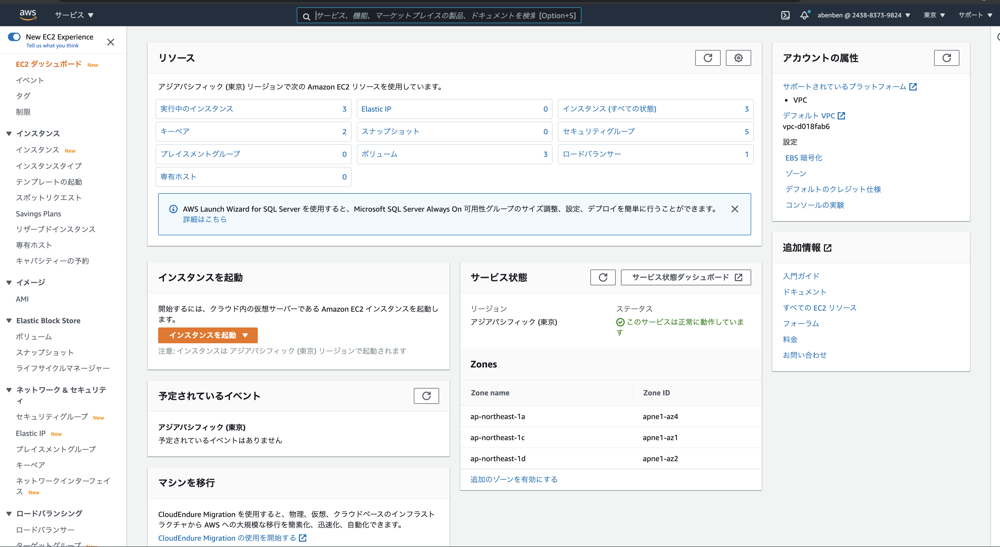

### AWS初級

2021年3月6日[Sat] / AWS

finpy / abenben

---

### アジェンダ

* AWSのサービスの種類
* EC2を操作
* まとめ

---

### お知らせ

* [JAWS DAYS 2021](https://jawsdays2021.jaws-ug.jp/)
  * 2021年3月14日(日)9:50〜20:00
* [みんなのPython勉強会#67](https://startpython.connpass.com/event/201613/)
  * 2021年3月10日(水)20:00〜20:30
* [保険×AI×プラットフォーム（フィンテックエンジニア養成勉強会#14）](https://fintech-engineer.connpass.com/event/205267/)
  * 2021年4月8日(木)19:00〜21:00

---

### AWSのサービスの概要（一部）

* EC2
* EBS
* S3

---

## EC2とは

Amazon EC2（Amazon Elastic Compute Cloud）とは、AWSが提供する「仮想サーバー」のことです。EC2を用いてLinuxやWindowsなどさまざまなOSの仮想サーバーをすぐに実行できる環境を用意することができます。Amazon EC2では、複数の仮想サーバーを立てることができます。

---

## EC2のインスタンス

AWS クラウドに立てられた仮想サーバーをインスタンスと呼びます。EC2やRDSなどの仮想サーバーを数える時に単位として使われます。

---

## EC2の操作

1.下準備
2.AWSのコンソールから作成する
3.CLIから
4.Botoから

---

### AWSコンソールでEC2を作成、起動、停止する


---

#### EC2のコンソールを開く

https://ap-northeast-1.console.aws.amazon.com/ec2/v2/home?region=ap-northeast-1#Home:



---

#### 1.キーペアを作成する

---

#### 2.コンソールからEC2のインスタンスを作成する(1)

---

#### 3.コンソールからEC2のインスタンスを停止する

---

#### 4.コンソールからEC2のインスタンスを起動する

---

#### （ポイント1）ロールの設定

---

#### （ポイント2）セキュリティグループの設定

---

## CLIでインスタンスの一覧を取得する

``` shell
$ aws ec2 describe-instances --output=table --query 'Reservations[].Instances[].{InstanceId: InstanceId, PrivateIp: join(`, `, NetworkInterfaces[].PrivateIpAddress), GlobalIP: join(`, `, NetworkInterfaces[].Association.PublicIp), Platform:Platform, State: State.Name, SecurityGroupId: join(`, `, SecurityGroups[].GroupId) ,Name: Tags[?Key==`Name`].Value|[0]}'
```

```
---------------------------------------------------------------------------------------------------------------------------------------
|                                                          DescribeInstances                                                          |
+----------------+----------------------+---------------+-----------+---------------+-------------------------------------+-----------+
|    GlobalIP    |     InstanceId       |     Name      | Platform  |   PrivateIp   |           SecurityGroupId           |   State   |
+----------------+----------------------+---------------+-----------+---------------+-------------------------------------+-----------+
|  xx.xx.xx.xx   |  i-xxxxxxxxxxxxxxxxx |  xxxxxxxxxxxx |  None     |  xxxxxxxxxxx  |  xxxxxxxxxxxxxxxxxxxx               |  running  |
|  xx.xx.xx.xx   |  i-xxxxxxxxxxxxxxxxx |  xxxxxxxxxxxx |  None     |  xxxxxxxxxxxx |  xxxxxxxxxxxxxxxxxxxx               |  running  |
|                |  i-0040e01748bce52ac |  test-abenben |  None     |  172.31.0.173 |  xxxxxxxxxxxxxxxxxxxxx              |  stopped  |
+----------------+----------------------+---------------+-----------+---------------+-------------------------------------+-----------+
```

---

## EC2でインスタンスを起動する

``` shell
$ aws ec2 start-instances --instance-ids （インスタンスID）　# 下は実行例
$ aws ec2 start-instances --instance-ids i-0040e01748bce52ac
{
    "StartingInstances": [
        {
            "CurrentState": {
                "Code": 0,
                "Name": "pending"
            },
            "InstanceId": "i-0040e01748bce52ac",
            "PreviousState": {
                "Code": 80,
                "Name": "stopped"
            }
        }
    ]
}
```

---

## 先ほどのコマンドでもう一度ステータスを確認する

``` shell
$ aws ec2 describe-instances --output=table --query 'Reservations[].Instances[].{InstanceId: InstanceId, PrivateIp: join(`, `, NetworkInterfaces[].PrivateIpAddress), GlobalIP: join(`, `, NetworkInterfaces[].Association.PublicIp), Platform:Platform, State: State.Name, SecurityGroupId: join(`, `, SecurityGroups[].GroupId) ,Name: Tags[?Key==`Name`].Value|[0]}'
---------------------------------------------------------------------------------------------------------------------------------------
|                                                          DescribeInstances                                                          |
+----------------+----------------------+---------------+-----------+---------------+-------------------------------------+-----------+
|    GlobalIP    |     InstanceId       |     Name      | Platform  |   PrivateIp   |           SecurityGroupId           |   State   |
+----------------+----------------------+---------------+-----------+---------------+-------------------------------------+-----------+
|  xx.xx.xx.xx   |  i-xxxxxxxxxxxxxxxxx |  xxxxxxxxxxxx |  None     |  xxxxxxxxxxx  |  xxxxxxxxxxxxxxxxxxxx               |  running  |
|  xx.xx.xx.xx   |  i-xxxxxxxxxxxxxxxxx |  xxxxxxxxxxxx |  None     |  xxxxxxxxxxxx |  xxxxxxxxxxxxxxxxxxxx               |  running  |
|  18.183.35.172 |  i-0040e01748bce52ac |  test-abenben |  None     |  172.31.0.173 |  xxxxxxxxxxxxxxxxxxxx               |  running  |
+----------------+----------------------+---------------+-----------+---------------+-------------------------------------+-----------+
```

---

## （補足）個別のインスタンスを指定して状態確認する方法

``` shell
$ aws ec2 describe-instance-status --instance-ids （インスタンスID）　# 下は実行例
$ aws ec2 describe-instance-status --instance-ids i-0040e01748bce52ac
{
    "InstanceStatuses": [
        {
            "AvailabilityZone": "ap-northeast-1c",
            "InstanceId": "i-0040e01748bce52ac",
            "InstanceState": {
                "Code": 16,
                "Name": "running"
            },
            "InstanceStatus": {
                "Details": [
                    {
                        "Name": "reachability",
                        "Status": "passed"
                    }
                ],
                "Status": "ok"
            },
            "SystemStatus": {
                "Details": [
                    {
                        "Name": "reachability",
                        "Status": "passed"
                    }
                ],
                "Status": "ok"
            }
        }
    ]
}
```

---

## （補足）CLIでキーペアの一覧を確認する


---

## SSHでEC2にログインする

``` shell
$ ssh -i （キーペアファイル） ec2-user@（グローバルIP）# 下は実行例
$ ssh -i ./.aws/finpy-test-abenben-01.pem ec2-user@18.183.35.172
The authenticity of host '18.183.35.172 (18.183.35.172)' can't be established.
ECDSA key fingerprint is SHA256:bMhcSc4cwjYW8amG3QM1yAXLL/QI5NecEHUh4H2nCCA.
Are you sure you want to continue connecting (yes/no/[fingerprint])? yes
Warning: Permanently added '18.183.35.172' (ECDSA) to the list of known hosts.
Last login: Fri Mar  5 20:31:03 2021 from fp9f1ca1d2.chbd116.ap.nuro.jp

       __|  __|_  )
       _|  (     /   Amazon Linux 2 AMI
      ___|\___|___|

https://aws.amazon.com/amazon-linux-2/
```

---

## EC2からCLIコマンドを動かす

* デフォルトで導入されている

``` shell
$ aws s3 ls
```

---

---

## Python3とJupterインストール

``` shell
$ sudo amazon-linux-extras install python3
$ sudo python3 -m pip install --upgrade pip
$ sudo python3 -m pip install jupyter
```

---

```
$ jupyter notebook --ip='0.0.0.0'
```

* ブラウザで確認
  * http://(グローバルIP):8888
* 自分の場合は以下のURL
  * http://18.183.35.172:8888

---

## セッションマネージャーを理解する

---

## OSのイメージを作成する

---

## OSイメージからインスタンスを起動する

---

## Amazon EBS

Amazon EBS（Amazon Elastic Block Store）は、AWS上で操作できる仮想ディスクです。管理コンソールからEBSボリュームを作って、それをサーバーインスタンスへ接続、切断できます。接続することをアタッチ、切断をデタッチと呼びます。

---

